# AttendEase

> Version 0.0.1

A contact-free, real-time attendance system using facial recognition. Students are automatically logged when their face is detected by the camera — no manual check-in required.

---

## System Architecture



---

## Tech Stack

| Layer | Technology |
|---|---|
| Frontend | Next.js 16, React 19, Tailwind CSS v4, TypeScript |
| Backend | FastAPI, Python 3.11, Uvicorn |
| Face Recognition | `face_recognition`, OpenCV (`cv2`) |
| Data Storage | CSV (attendance log), Pickle (face encodings) |
| UI Components | Lucide React, next-themes |
| Package Manager | pnpm (frontend), pip (backend) |

---

## Project Structure

```
attendease/
├── backend/
│   ├── app/
│   │   └── main.py               # FastAPI app, API routes
│   ├── face_engine/
│   │   ├── dataset/              # Face image dataset (one folder per person)
│   │   ├── scanner.py            # Camera loop + face recognition worker
│   │   ├── encoder.py            # Encodes dataset into encodings.pkl
│   │   ├── face_utils.py         # Image saving + encoding loader
│   │   ├── encodings.pkl         # Serialized face encodings
│   │   └── attendance.csv        # Attendance log
│   ├── services/
│   │   └── attendance_logger.py  # Writes attendance records to CSV
│   └── myEnv/                    # Python virtual environment
├── frontend/
│   ├── app/
│   │   ├── page.tsx              # Home / portal selector
│   │   ├── login/                # Login page
│   │   ├── scan/                 # Live scanner page (Admin)
│   │   ├── admin/                # Admin dashboard
│   │   ├── teacher/              # Teacher dashboard
│   │   └── student/              # Student dashboard
│   ├── components/               # Shared UI components
│   └── hooks/                    # Shared hooks (useClock)
└── README.md
```

---

## Getting Started

### Prerequisites

- Python 3.11
- Node.js 18+ and pnpm
- A webcam (built-in or USB)

---

## Backend Setup

### 1. Activate the virtual environment

```bash
cd backend
myEnv\Scripts\activate
```

### 2. Install dependencies

```bash
myEnv\Scripts\python.exe -m pip install fastapi uvicorn python-multipart face_recognition opencv-python pillow numpy
```

### 3. Run the backend server

```bash
myEnv\Scripts\uvicorn app.main:app --reload --port 8000
```

The API will be available at `http://localhost:8000`.

---

## Dataset — Adding a New Person

Face images are stored under `backend/face_engine/dataset/`.

### Naming convention

Each person gets their own folder named as:

```
FirstName_MiddleName_LastName_MMDDYYYY
```

Example:
```
face_engine/dataset/Joshua_Flores_Verceles_12022002/
```

> The last segment (after the final `_`) is always treated as the birthdate. Everything before it is the full name.

### Steps to add a new person

1. Create a folder inside `face_engine/dataset/` using the naming convention above
2. Add at least 2–5 clear face images (`.jpg` or `.png`) inside that folder
3. Re-run the encoder to update the encodings

```bash
cd backend
myEnv\Scripts\python.exe -m face_engine.encoder
```

You should see:
```
✅ Encodings updated
```

---

## Running the Scanner (Standalone)

To run the face scanner directly without the web interface:

```bash
cd backend
myEnv\Scripts\python.exe -m face_engine.scanner
```

- Press `Q` or close the window to stop
- Attendance is logged to `face_engine/attendance.csv`
- Entries are deduplicated: same person within 30 seconds is ignored, re-entry allowed after 2 hours, new day resets the count

---

## Attendance CSV Format

```
Name,Birthdate,Time,Date,Type
Joshua Flores Verceles,12022002,08:00:00,2026-04-18,entry
Joshua Flores Verceles,12022002,10:30:00,2026-04-18,reentry
Joshua Flores Verceles,12022002,08:05:00,2026-04-19,entry
```

| Column | Description |
|---|---|
| Name | Full name parsed from dataset folder |
| Birthdate | DOB parsed from folder name (MMDDYYYY) |
| Time | Time of detection (HH:MM:SS) |
| Date | Date of detection (YYYY-MM-DD) |
| Type | `entry` = first scan of the day, `reentry` = subsequent scan after 2h |

---

## Frontend Setup

```bash
cd frontend
pnpm install
pnpm dev
```

The app will be available at `http://localhost:3000`.

### Login roles (mock auth)

| Email contains | Role | Redirects to |
|---|---|---|
| `admin` | Admin | `/admin` |
| `teacher` | Teacher | `/teacher` |
| anything else | Student | `/student` |

Example: `admin@school.edu`, `teacher@school.edu`, `student@school.edu`

---

## API Endpoints

| Method | Endpoint | Description |
|---|---|---|
| `GET` | `/` | Health check |
| `POST` | `/register` | Register a face (name + image upload) |
| `POST` | `/start-scan` | Start the camera scanner thread |
| `GET` | `/stream` | MJPEG live camera stream |
| `GET` | `/attendance/recent` | Last 20 attendance records (newest first) |

---

## Running Both Together

Open two terminals:

**Terminal 1 — Backend**
```bash
cd backend
myEnv\Scripts\activate
myEnv\Scripts\uvicorn app.main:app --reload --port 8000
```

**Terminal 2 — Frontend**
```bash
cd frontend
pnpm dev
```

Then open `http://localhost:3000` in your browser.

---

## Notes

- The scanner window opens on the machine running the backend
- The live stream is viewable in the browser at `/scan` (Admin only)
- Face encodings must be regenerated every time the dataset changes
- The attendance CSV is append-only; clear it manually to reset logs
